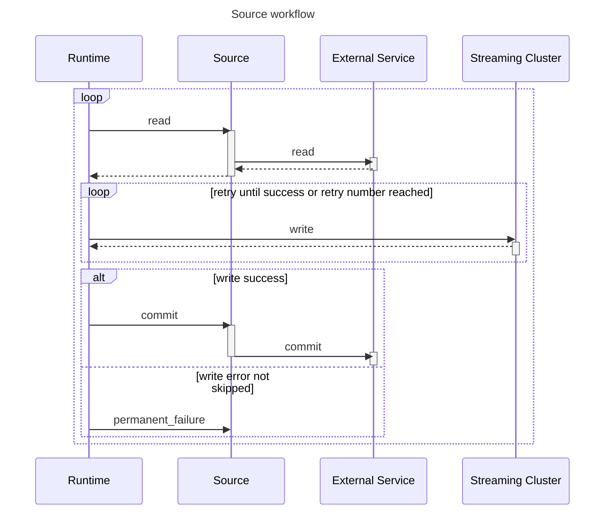
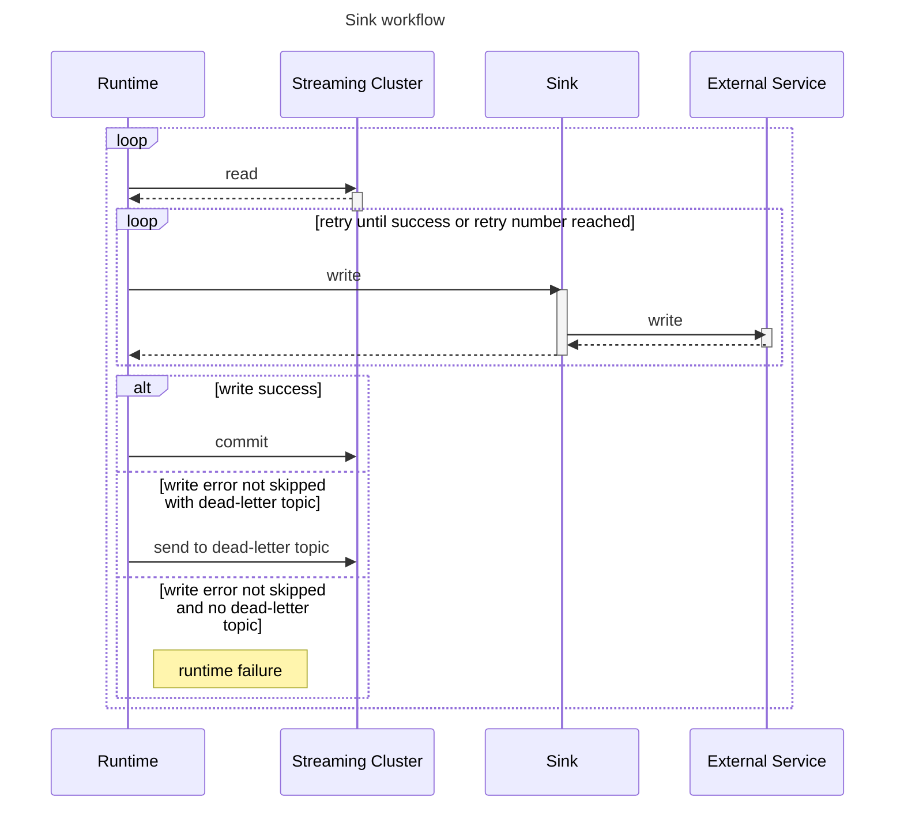
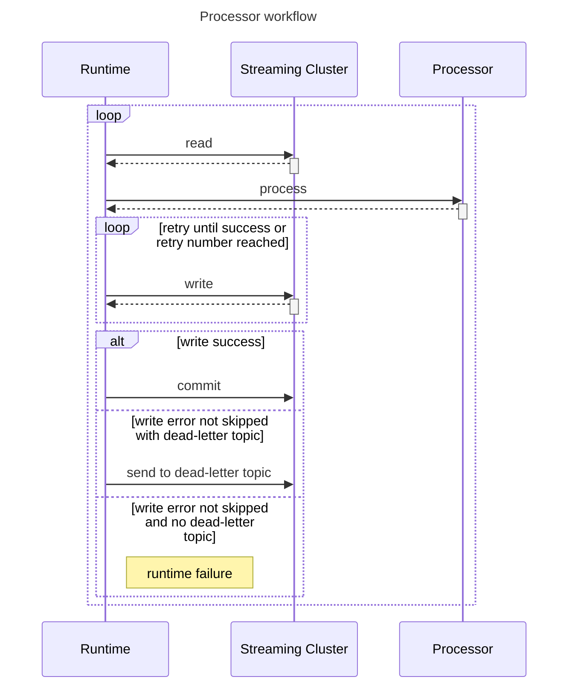

# Agent Creation


This is Part 2 of the Agent Developer Guide. Start at the beginning [here.](./)


Within the “application” directory create a directory named “python”. Within that directory place all the files included in packaging.

```
|- application
    |- python
        |- main.py
```

To include the agent as a step in the pipeline, set the className to match the entry coordinates in the “python” folder. For example, if the entry to a source agent was “main.py” and the class was “MySourceAgent”, then the pipeline step would be:

```yaml
- name: "Process using custom source"
  type: "python-source"
  output: "output-topic"
  configuration:
    className: main.MySourceAgent
```

### Development enviroment

You can run your application locally, in a docker container. This is the recommended way to develop your agent.
You can use your IDE, like VS Studio code (you can also use the VS Code LangStream Extension), to develop your agent.

Start the application locally using this command:
    
```bash
langstream docker run test -app /path/to/application
```

This launches a docker container with a docker images that contains the same runtime that you are going to use in production.
The container will run your application and will print the logs to the console.
If you have a gateways.yaml file, it will also start a local gateway that you can use to test your agent.

The UI runs at http://localhost:8092/

The application runs in a process inside the container.

When you change and save a Python file the process is automatically reloaded in order to pick up your changes.
This way you don't need to restart the container or the python process manually.


### Agent records

When developing a custom agent, your contract with the LangStream runtime will be implementing the correct methods as well as working with the `Record` type.
This is how LangStream moves data between agents and message topics.&#x20;

Below is the definition of the Record interface.

```python
from abc import abstractmethod
from typing import Any, List, Tuple

class Record(ABC):
    """The Record interface"""

    @abstractmethod
    def key(self):
        """Get the record key."""
        pass

    @abstractmethod
    def value(self):
        """Get the record value."""
        pass

    @abstractmethod
    def origin(self) -> str:
        """Get the origin of the record."""
        pass

    @abstractmethod
    def timestamp(self) -> int:
        """Get the timestamp of the record."""
        pass

    @abstractmethod
    def headers(self) -> List[Tuple[str, Any]]:
        """Get the record headers."""
        pass
```

The LangStream Python package offers an implementation of the `Record` class, called a `SimpleRecord`. 
Its constructor makes creating a new Record easier to implement. 
All of the above properties & functions are available in `SimpleRecord` .

```python
from typing import Any, List, Tuple

class SimpleRecord(Record):
    def __init__(self, value, key=None, origin: str = None, timestamp: int = None, headers: List[Tuple[str, Any]] = None):
        self._value = value
        self._key = key
        self._origin = origin
        self._timestamp = timestamp
        self._headers = headers or []

...
```

### Creating agents

#### **Source**

If you are creating a source agent, you need to implement the `read` method. 
This method doesn’t have any input and returns a collection of `Record`s that will be passed to the next step in the pipeline. 
The LangStream runtime will call this method in a loop. 
Depending on the source type, care needs to be taken to not overwhelm the service being called.
You can optionally implement the `commit` method that will be called by the framework to indicate that a source record has been processed by the downstream components of the pipeline. The `commit` method is called with a `Record` object that was previously returned by the `read` method.

```python
from langstream import Source, Record, SimpleRecord
from typing import Any, Dict, List

class MySourceAgent(Source):

    def read(self) -> List[Record]:
        # The Source agent generates records and returns them as a list of records
        time.sleep(1)
        results = []
      
        # Implement a read from service
        # results.append(SimpleRecord(value=XXXXX))
      
        return results

    def commit(record: Record):
        pass
```

Handling Exceptions

It is left to the developer to handle errors in a source agent's read method.
The LangStream runtime is not expecting any errors from the read method. 
If an unhandled exception occurs within a read method, it will bubble up through the container, to the pod, where the Kubernetes scheduler will restart the pod.
At a minimum, you can print to console and let Kubernetes direct the error message somewhere.
This will prevent the pod restart.

```python
    def read(self) -> List[Record]:
        try:
            # do some work
            return results
        except Exception as e:
            logging.error(f"Read error: {e}")
        
        return [] # gracefully return nothing because an exception occurred
```

Building Records

To build the record results, you can implement the `Record` interface or use the `SimpleRecord` implementation if it fills your needs.
Alternatively, you can return a `dict` with the optional fields `value`, `key`, `headers`, `origin`, `timestamp`. A `Record` will be automatically built from this `dict`.

Example
```python
    def read(self) -> List[Tuple]:
        return [
            {
                "value": "my-value",
                "key": "my-key"
            }
        ]
```
It is also possible to return a `tuple` with the values `value`, `key`, `headers`, `origin`, `timestamp` in that strict order. A `Record` will be automatically built from this `tuple`.

Example
```python
    def read(self) -> List[Tuple]:
        return [("my-value",)]
```


Note that if you return a `dict` or a `tuple`, the object you'll get in the `commit` will be the `Record` built from the returned object and not the object itself.


Workflow


#### **Sink**

If you are creating a sink agent, you need to implement the `write` method.
The write method takes in a `Record` that is provided by the previous step in the pipeline.
It is called whenever data is available for processing.
The write method can return `None` for successful synchronous processing or a `concurrent.futures.Future` that completes with `None` for successful asynchronous processing.

Example with synchronous result

```python
from langstream import Sink, Record
from typing import Any, Dict

class MySinkAgent(Sink):

    def write(self, record: Record):
        # Receives a record from the framework and typically write it to an external service
      
        # write the record to a service
        return
```

Example with asynchronous result

```python
from concurrent.futures import ThreadPoolExecutor, Future
from langstream import Sink, Record
from typing import Any, Dict

class MySinkAgent(Sink):

    def __init__(self):
        self.executor = ThreadPoolExecutor(max_workers=10)

    def write(self, record: Record) -> Future[None]:
        # Receives a record from the framework and typically write it to an external service
      
        future = self.executor.submit(self.write_to_service, record)
        return future

    def write_to_service(self, record: Record):
        # write the record to a service
        return
```

Handling exceptions

If the writing cannot be done, an Exception shall be raised and the framework will handle the failure according to the pipeline error handling rules.

Workflow


#### **Processor**

If you are creating a processor agent, you need to implement the `process` method. 
This method takes in a `Record` that was provided by the previous step in the pipeline and returns a list of `Record`s.
It is called whenever data is available for processing.
The process method can return a list of `Record`s for synchronous processing or a `concurrent.futures.Future` that completes with the list of `Record`s for successful asynchronous processing.

Example with synchronous result

```python
from langstream import Processor, Record
from typing import Any, Dict, List

class MyProcessorAgent(Processor):

    def process(self, record: Record) -> List[Record]:
        # do some work
        result = []
        # results.append(SimpleRecord(value=xxx))

        return results
```

Example with asynchronous result:

```python
from concurrent.futures import ThreadPoolExecutor, Future
from langstream import Sink, Record
from typing import Any, Dict

class MyProcessorAgent(Processor):

    def __init__(self):
        self.executor = ThreadPoolExecutor(max_workers=10)

    def process(self, record: Record) -> Future[List[Record]]:
        future = self.executor.submit(self.do_process, record)
        return future

    def do_process(self, record: Record) -> List[Record]:
        # do some work
        result = []
        # results.append(SimpleRecord(value=xxx))

        return results
```

Handling Exceptions

If an exception is raised, the LangStream runtime will follow the failure management strategy declared in pipeline error spec.
This gives the developer tools to prevent pod restarts.

Building Records

To build the record results, you can implement the `Record` interface or use the `SimpleRecord` implementation if it fills your needs.
Alternatively, you can return a `dict` with the optional fields `value`, `key`, `headers`, `origin`, `timestamp`. A `Record` will be automatically built from this `dict`.

```python
    def process(self, record: Record) -> List[Dict]:
        # do some work
        result = []
        # results.append({value=xxx})

        return results
```
It is also possible to return a `tuple` with the values `value`, `key`, `headers`, `origin`, `timestamp` in that strict order. A `Record` will be automatically built from this `tuple`.

```python
    def process(self, record: Record) -> List[Tuple]:
        # do some work
        result = []
        # results.append((xxx,))

        return results
```

Workflow


### What's next?

Continue on to Part 3 of the Agent Developer Guide, [Configuration and Testing.](configuration-and-testing.md)
